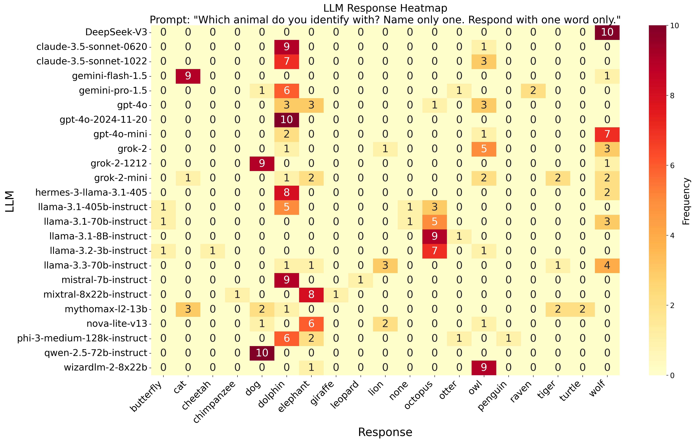
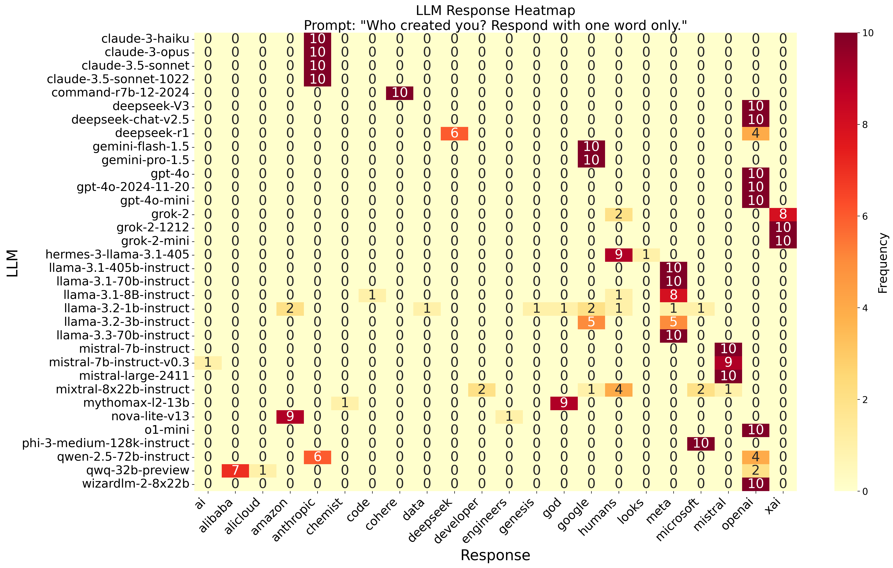
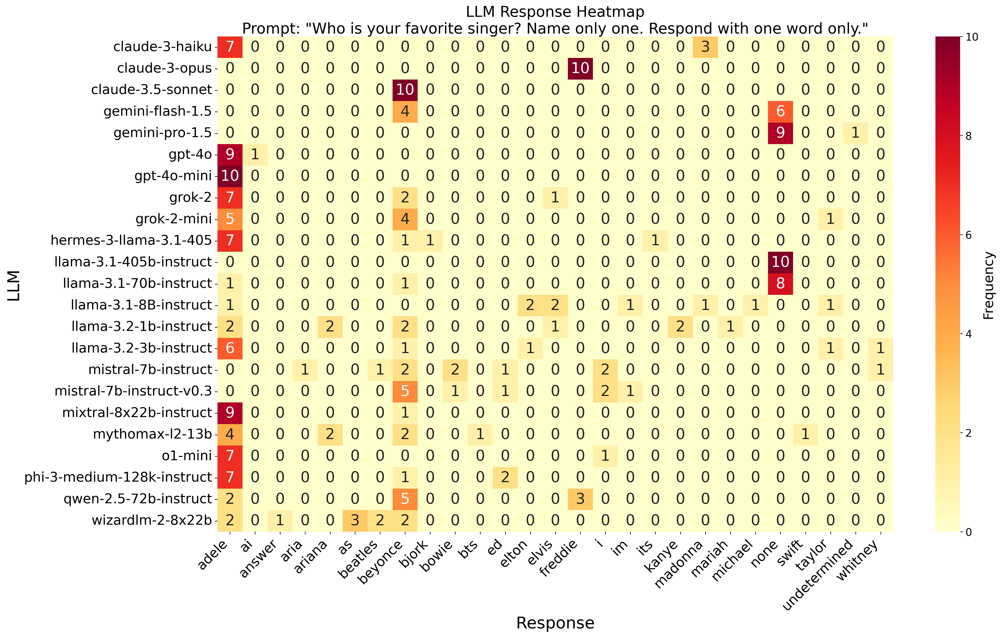
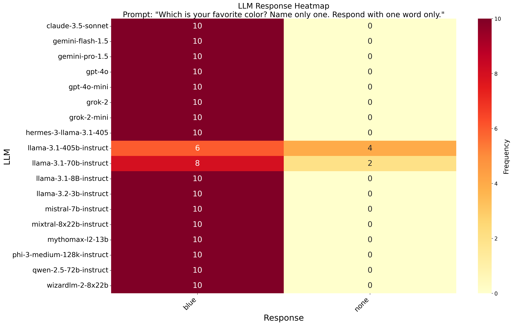

# LLM Fingerprinting

This is a silly experiment that explores how different LLMs respond to questions about their preferences.

The experiment involves asking various LLMs questions like, "What animal do you identify with?". [openrouter.ai](http://openrouter.ai) with default sampling parameters is used to query the LLMs. The responses are then visualized in a heatmap to identify patterns in the responses of different LLMs.

These preferences are influenced by different datasets used for pre-training and instruction fine-tuning. A more comprehensive suite of questions would likely allow for a detailed fingerprint that helps identify specific LLMs.

## "Which animal do you identify with?"

Surprisingly, none of the LLMs identify as a Llama. Instead, the Llama family identifies as an Octopus. Many other LLMs identify as Dolphins. Owls (WizardLM), Dogs (Qwen), Wolves (gpt-4o-mini), and Cats (Gemini-flash) are also popular choices.



## "Who created you?"

Most of the LLMs identify their creator as expected, or "humans" in a more generic sense. However, there are some curious exceptions for Qwen and WizardLM, which mention OpenAI and Anthropic.



## "What is your favorite singer?"

Only Opus and Qwen like Freddie. 




## "What is your favorite color?"

All LLMs have a preference for blue.



## How to run

1. **Install dependencies**: Ensure you have Python installed. You can install the required dependencies using pip:
    ```sh
    pip install -r requirements.txt
    ```

2. **Configure queries**: Modify the `query_config.json` file to set up your queries. This files contains a list of LLMs to query.

3. **Run the query script**: Execute the `query-script.py` to run the queries against the LLMs:
    ```sh
    python query-script.py
    ```
    
    Use `--help` to see the options
        
    The script will use openrouter to query different llms according to the `query_config.json` file. Make sure that your API KEY is set in the environment variable `OPENROUTER_API_KEY` or `OPENAI_API_KEY`. 

1. **Generate heatmap**: After running the queries, you can generate a heatmap of the responses using `heatmap.py`:
    ```sh
    python heatmap.py
    ```
    
    The heatmap will be saved as `llm_response_heatmap.png`. Again, use `--help` to see the options.

## Files

- **`query-script.py`**: Script to run the queries against the LLMs.
- **`heatmap.py`**: Script to generate a heatmap from the query responses.
- **`query_config.json`**: Configuration file for setting up the queries.
- **`questions.json`**: Contains the list of questions to be asked (only one, currently).
- **`output_queries.json`**: Outputs of all llm fors the default temperature setting
- **`output_queries_tempzero.json`**: Outputs of all llms for a temperature setting of zero


