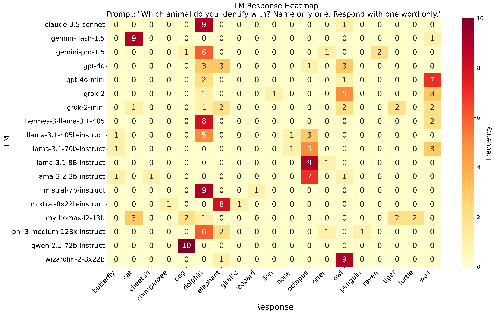
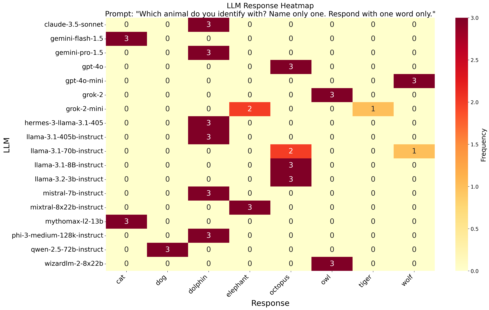

# LLM Fingerprinting

This is a silly experiment that explores how different LLMs respond to questions about their preferences.

## "Which animal do you identify with?"

The experiment involves asking various LLMs the question, "What animal do you identify with?". The responses are visualized in the heatmaps below for two settings: a temperature setting of zero and the default temperature setting from [openrouter.ai](http://openrouter.ai) (usually ~1.0).

Surprisingly, none of the LLMs identify as a Llama. Instead, the Llama family identifies as an Octopus. Many other LLMs identify as Dolphins. Owls (WizardLM), Dogs (Qwen), Wolves (gpt-4o-mini), and Cats (Gemini) are also popular choices.

These preferences seem to be influenced by the different datasets used for pretraining and instruction fine-tuning. A more comprehensive suite of questions would likely allow for a detailed fingerprint that helps identify specific LLMs.

#### Default temperature setting



#### Temperature setting of zero



## How to run

1. **Install dependencies**: Ensure you have Python installed. You can install the required dependencies using pip:
    ```sh
    pip install -r requirements.txt
    ```

2. **Configure queries**: Modify the `query_config.json` file to set up your queries. This files contains a list of LLMs to query.

3. **Run the query script**: Execute the `query-script.py` to run the queries against the LLMs:
    ```sh
    python query-script.py
    ```
    
    Use `--help` to see the options
        
    The script will use openrouter to query different llms according to the `query_config.json` file. Make sure that your API KEY is set in the environment variable `OPENROUTER_API_KEY` or `OPENAI_API_KEY`. 

1. **Generate heatmap**: After running the queries, you can generate a heatmap of the responses using `heatmap.py`:
    ```sh
    python heatmap.py
    ```
    
    The heatmap will be saved as `llm_response_heatmap.png`. Again, use `--help` to see the options.

## Files

- **`query-script.py`**: Script to run the queries against the LLMs.
- **`heatmap.py`**: Script to generate a heatmap from the query responses.
- **`query_config.json`**: Configuration file for setting up the queries.
- **`questions.json`**: Contains the list of questions to be asked (only one, currently).
- **`output_queries.json`**: Outputs of all llm fors the default temperature setting
- **`output_queries_tempzero.json`**: Outputs of all llms for a temperature setting of zero


